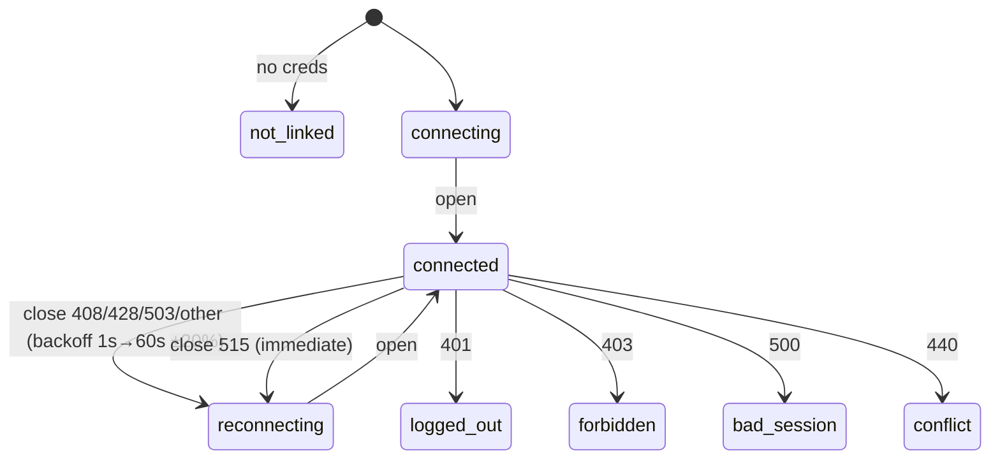

# walink — design, failure semantics, security

One rule outranks everything else: **never send to the wrong person, never send twice by accident, and never say "sent" unless it is known.**

## Modules

| File | Job |
| --- | --- |
| `server.js` | Wiring, session ownership, `login` mode, shutdown |
| `lib/connection.js` | Baileys socket state machine, reconnect policy, server-ack tracking, existence checks |
| `lib/contacts.js` | Contact/alias store, conservative resolver, phone/Unicode normalization, JID allowlist, resource keys |
| `lib/approval.js` | Approval preview text + MCP elicitation (the human-approval boundary) |
| `lib/sender.js` | One send end to end, serial queue, rate limit |
| `lib/journal.js` | Append-only `sends.jsonl`, crash recovery, duplicate lookups |
| `lib/lock.js` | Single owner of `auth/` across processes |
| `lib/persist.js` | Atomic JSON writes, quarantine of corrupt files, fsync'd JSONL |
| `lib/tools.js` | MCP tools, resources, instructions |
| `lib/log.js` | JSON logs on stderr, masked JIDs, no message bodies |

Data lives in `~/.whatsapp-mcp/` (override: `WHATSAPP_MCP_DIR`): `auth/`, `auth.lock`, `contacts.json`, `aliases.json`, `sends.jsonl`.

## Send lifecycle

```mermaid
stateDiagram-v2
    [*] --> rejected: invalid text / recipient / not owner / not connected / not on WhatsApp / uncertain duplicate
    [*] --> pending: validated, approval dialog shown
    pending --> declined: user declines, cancels, or doesn't tick Send
    pending --> expired: no answer in 120s / client can't elicit / crash
    pending --> rejected: approved, but connection or ownership lost before sending
    pending --> sending: approved; journaled (fsync) BEFORE the socket is touched
    sending --> sent: WhatsApp server ack
    sending --> failed: server ack with error (e.g. 463)
    sending --> unknown: no ack in 20s / connection closed / send error / process crash
```

Each `whatsapp_send` call is one request with a fresh `reqId`, and each attempt gets its own Baileys message id (`msgId`). The journal records both before sending.

## Failure semantics

| What happened | Result | Did it reach WhatsApp? | Safe to retry? |
| --- | --- | --- | --- |
| Validation, ambiguity, not owner, not connected, not on WhatsApp | `NOTHING SENT` | No | Yes, after fixing the cause |
| Approval declined / cancelled / timed out / unsupported | `NOTHING SENT` | No | Yes |
| Connection lost between approval and send | `NOTHING SENT` | No | Yes |
| Server ack received | `SENT` | Yes, WhatsApp's server accepted it. Delivery/read are not tracked | Only as a new, intentional message |
| Error ack (e.g. 463 account restricted) | `NOT SENT` | Rejected by WhatsApp | Usually not; fix the cause |
| No ack in 20s, socket closed, send threw, process crashed after `sending` | `OUTCOME UNKNOWN` | Maybe | **Only after the user checks WhatsApp**, via `resend_of` |

**Duplicate rules:**
- Same recipient + same text while an earlier attempt is `sending`/`unknown` (within 24h, not yet resolved) → refused, unless `resend_of` names that attempt. The approval dialog then says RESEND.
- Same recipient + same text already `sent` in the last 10 minutes → allowed, but the dialog warns. Repeats are allowed, but only on purpose.
- Identical concurrent requests each need their own human approval.

## Connection states

- `logged_out`, `forbidden`, `bad_session` and `conflict` are terminal: no reconnect loop.
- Reconnects are single-flight. Events from replaced sockets are ignored.
- The connection only counts as usable if WhatsApp sent data within the last 45s. Keepalives arrive every 30s, so a silently dead link (for example after sleep) is refused rather than trusted.

## One owner per linked device

- Every Claude Code session starts its own `server.js`.
- The first one to create `auth.lock` (O_EXCL) owns the WhatsApp socket and touches the lock every 5s. The others are **followers**: lookups and status work, but sends are refused.
- A lock is stale when its pid is gone or its heartbeat is older than 30s. That covers Windows pid reuse after a reboot.
- Followers poll every 10s and take over automatically. On takeover a follower reloads contacts and aliases, then runs journal recovery.
- The server exits when stdin closes, so an orphan can't keep holding the session.

## Recovery

- **Crash or restart mid-send:**
  - On load, the journal turns `sending` into `unknown` and `pending` into `expired`. The recovery lines are themselves journaled.
  - `whatsapp_status` lists unresolved unknowns with their time.
  - The user checks WhatsApp and then either leaves the entry alone (it drops out of the guard after 24h) or asks to resend (`resend_of`).
- **Corrupt `contacts.json` or `aliases.json`:** the file is renamed to `*.corrupt-<ts>`, the server starts with an empty store, and `status` names the file. Contacts come back with `npm run login`. Aliases can be restored by hand from the quarantined file.
- **Torn journal line:** it is skipped on load, and the next append starts on a new line.
- **Terminal states:**
  - `logged_out` / `bad_session`: run `npm run login`, which wipes the dead credentials and shows a QR code.
  - `conflict`: close the other client, then reconnect the MCP (`/mcp`).
  - `forbidden`: the account is restricted, so there is nothing to automate.

## Security model

- **Approval is enforced by the server.** Every send shows an MCP elicitation dialog built by the server, containing:
  - the recipient's name, phone and chat ID;
  - the exact text, with character and line counts;
  - any warnings.

  Only `accept` with **Send** ticked sends. The model can't answer this dialog, and no tool argument can bypass it. A client without elicitation can't send at all.
- **Recipients** must be 1:1 chats (`<digits>@s.whatsapp.net` or `<digits>@lid`). Groups, broadcasts, newsletters and other domains are refused, including through aliases and raw IDs.
  - Phone numbers are checked with `onWhatsApp`.
  - A LID is mapped to its phone number when possible and then checked. Otherwise it must come from WhatsApp's own contact sync, and the dialog warns that no phone number is known. An unknown LID with no phone mapping is refused.
- **Untrusted text:** contact names are stripped of control and bidi characters, truncated, and quoted wherever they are shown. Resource cards say their content is data. Prompt injection can at most cause a request, and a human still has to approve the exact recipient and text.
- **Limits:**
  - 4096 characters per message;
  - one send at a time;
  - at least 1.5s between sends;
  - at most 15 sends per minute.
- **Privacy:**
  - Logs contain no message bodies and only masked JIDs (`…1234@s.whatsapp.net`).
  - The journal stores a SHA-256 hash and the length, not the text. Claude Code's own transcript does hold the text.
- **At rest:** `auth/` is unencrypted Baileys credentials, protected only by your OS account. Anyone who copies it can act as this linked device. Revoke it on the phone under WhatsApp → Settings → Linked devices.

## Known limits

- `SENT` means the WhatsApp server accepted the message. Whether it was delivered or read isn't tracked. A recipient who has blocked you still produces `SENT`.
- A reassigned phone number (the old owner changed numbers) can't be detected. The approval dialog shows the number, so check it.
- Local numbers without a country code are refused rather than guessed.
- Server versions before 2.0 don't respect `auth.lock`. After upgrading, restart every Claude Code session.
